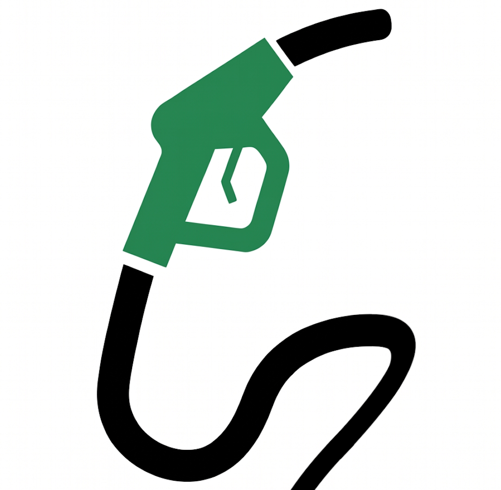

<div align="center">



# Pieno

**Dove faccio il pieno adesso, e quanto risparmio.**

Prezzi dei carburanti in Italia — benzina, gasolio, GPL, metano.
Nessuna registrazione, nessuna pubblicità, dati pubblici del Ministero.

</div>

---

Il prezzo più basso non serve a niente se ci arrivi dopo venti minuti di coda, e «2,059 €/l»
non dice nulla mentre guidi. Pieno risponde con un numero solo, quello che conta davvero:

> **Risparmi 3,25 € sul pieno.**

Un elemento dominante per schermata — il prezzo. Una sola azione — **Portami qui**.
Tutto il resto in secondo piano.

## Cosa fa

**Il risparmio in euro, non in millesimi.** Il confronto con la media della zona, sulla base
del tuo serbatoio. Sotto i 50 centesimi non te lo diciamo nemmeno: non è una cifra che
cambia una decisione.

**Due viste dello stesso dato.** Mappa ed elenco condividono carburante, posizione e
selezione: passare dall'una all'altra non ricarica niente. Sulla mappa il prezzo *è* il
marcatore — nessuna icona di pompa, solo numeri leggibili a braccio teso.

**«Portami qui» e sei in strada.** Apre Apple Maps, Google Maps o Waze, quello che usi già,
con traffico e voce che conosci.

**Funziona senza di te.** Nessun account, nessuna email. L'ultima zona resta sul telefono:
in galleria o senza campo l'app apre lo stesso, dicendoti quanto è vecchio il dato.

**Ordini come vuoi.** Il più economico, il più vicino, o il compromesso fra i due.
Con raggio di ricerca e soglia di aggiornamento decisi da te.

## L'onestà sul dato

È la parte di cui andiamo più fieri, ed è anche la meno appariscente.

Nessuna app può dirti il prezzo «in tempo reale»: i prezzi sono quelli che i gestori
comunicano al Ministero, pubblicati ogni giorno. Quindi non lo scriviamo. **L'età del dato
è sempre in vista**, gli impianti con listini abbandonati vengono esclusi invece di essere
spacciati per attendibili, e ogni giorno un controllo automatico scarta coordinate
sbagliate, prezzi assurdi e salti sospetti. Se il file del giorno è rotto, l'app continua a
servire quello buono del giorno prima — dicendoti che è di ieri.

Se trovi un prezzo diverso alla pompa, lo segnali dalla scheda dell'impianto.

## Come funziona

```
CSV del Ministero  →  validazione e controlli  →  un file per provincia su CDN  →  telefono
```

Nessun server da mantenere: un job notturno pulisce i dati e li pubblica come file statici,
l'app scarica solo la provincia che ti serve e fa tutto il resto — filtri, distanze,
risparmio — in locale. È il motivo per cui è veloce, gratis da gestire e non ha bisogno di
sapere chi sei.

| | |
| --- | --- |
| App | Flutter · Riverpod · MapLibre |
| Dati | Python, GitHub Actions, GitHub Pages |
| Percorsi | OSRM auto-ospitato + API in Go (`percorsi/`), su `percorsi.pienocarburanti.com` |
| Fonte | [Open data MIMIT](https://www.mimit.gov.it) (IODL 2.0) · mappa © OpenStreetMap |

**Dati pubblici, live:** [`manifest.json`](https://riccardo-05.github.io/pieno/manifest.json)

## Provare

```bash
cd app && flutter pub get && flutter run
```

```bash
cd data-pipeline && pip install -r requirements.txt
python -m pieno_pipeline.pipeline --scarica
```

## Stato

Le quattro schermate — Accesso, Mappa, Vicino a te, Impostazioni — sono complete e
funzionanti su dati veri, e l'app gira su iPhone. Le **distanze su strada** sono in
esercizio: le calcola un servizio nostro su `percorsi.pienocarburanti.com`, e quando non
risponde l'app ricade sulla stima dichiarandolo. Manca il passo finale: pubblicazione sugli
store.

Documentazione per chi mette le mani nel codice: il design system e le regole di progetto
in [`linee-guida/`](linee-guida), il job dati in [`data-pipeline/`](data-pipeline), l'app in
[`app/`](app), i difetti noti in [`revisione/`](revisione).

## Attribuzioni

Dati: Ministero delle Imprese e del Made in Italy — IODL 2.0 · © OpenStreetMap contributors

Licenza: da definire.
